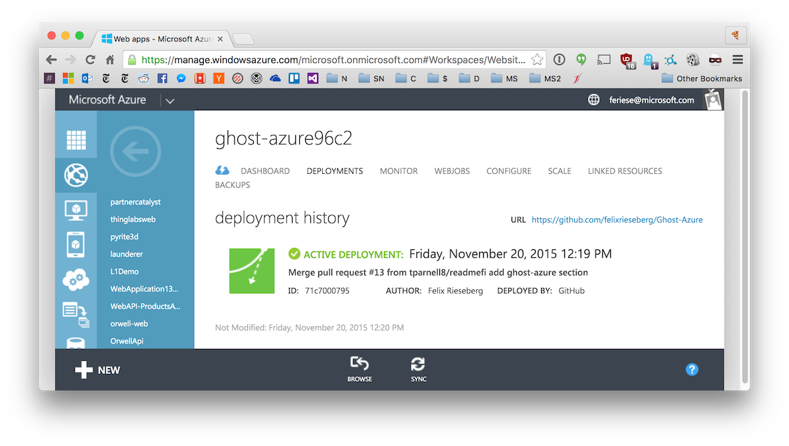

# [Ghost (0.11.11)](https://github.com/TryGhost/Ghost) 

Want to install Ghost on Azure? Just click the 'Deploy to Azure' button and you're well on your way to have a Ghost Blog running within a minute or two. Made with :heart: for Ghost by Microsoft.

**Note: The deployment will most likely fail if you're running in a Free or Shared App Service Plan.  This is due to NPM using more resources than the Azure [sandbox](https://github.com/projectkudu/kudu/wiki/Azure-Web-App-sandbox) allows.  To work around this, deploy into a Basic or higher plan and then scale down if needed.  More information in [#30](https://github.com/felixrieseberg/Ghost-Azure/issues/30#issuecomment-217028469) and [npm/npm#7200](https://github.com/npm/npm/issues/7200).** 

**Note: After deployment, Ghost will continue setup - resulting in your brand new website staying blank on the very first load. Please give your website a solid minute of time. It will appear like the site isn't loading, but in reality, it's just creating your database in the background. This only happens the very first time you load your website - simply refresh, you'll see that everything worked well!**

If you're interested in hosting your blog's images on Azure Blob Storage, check out Tommy Parnell's [ghost-azure-storage module](https://github.com/tparnell8/ghost-azurestorage) that plugs directly into Ghost.

#### Custom Domain
Directly after installation, Ghost will assume that your blog runs at `http://sitename.azurewebsites.net`. Should you switch to a custom domain, please inform Ghost about that change - you can do by setting the App Setting `websiteUrl` and restarting your website.

## Ghost

Ghost is a free, open, simple blogging platform that's available to anyone who wants to use it. Lovingly created and maintained by [John O'Nolan](http://twitter.com/JohnONolan) + [Hannah Wolfe](http://twitter.com/ErisDS) + an amazing group of [contributors](https://github.com/TryGhost/Ghost/contributors).

Visit the project's website at <http://ghost.org> &bull; docs on <http://support.ghost.org>.

## Ghost-Azure

Ghost Azure is a project that maintains the minimum configuration required to run ghost in azure Web Apps. This project does not contain alterations to ghost itself.  

## Running Locally

To run ghost locally run npm install then simply add websiteUrl, PORT, and NODE_ENV to your environment variables and run npm start. By default NODE_ENV will default to development, but the process that runs in azure runs with the value of production. If you decide to run NODE_ENV as production, you will probably want to turn off forceAdminSSL in config.js otherwise trying to access admin will default to redirecting you to https, and you won't have a valid SSL cert locally. The websiteUrl can be something as simple as `http://localhost` and the PORT variable should be the port you wish the instance to listen on.

## Upgrading Ghost
The most comfortable way to update is to synchronize your Ghost installation with this respository. When you hit the deploy button, Azure will be aware of the source - and allow you to synchronize content. When you synchronize a deployment, only files checked into the repository are updated - nothing is deleted. If you didn't change the Ghost source code (but instead just created posts, uploaded pictures, or added themes), simply click the "Sync" button in the Azure Management Portal:

If you copied the files in this repository manually, you can still update with ease. See the [Ghost-Updater-Azure](https://github.com/felixrieseberg/Ghost-Updater-Azure) project for details.

## Copyright & License

Ghost is Copyright (c) 2013-2017 Ghost Foundation - Released under the [MIT license](LICENSE).
